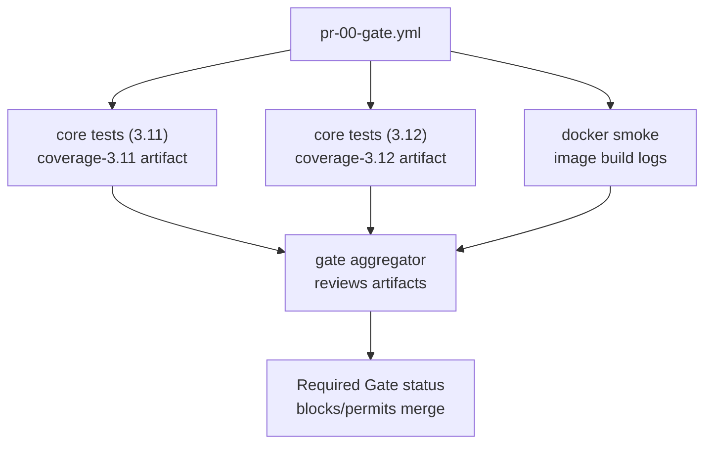

# Workflow Catalog & Contributor Quick Start

Use this page as the canonical reference for CI workflow naming, inventory, and
local guardrails. It consolidates the requirements from Issues #2190, #2202,
and #2466. Gate remains the required merge check for every pull request, and
**Agents 70 Orchestrator is the sole supported automation entry point**. The
legacy consumers continue to exist only as deprecated compatibility shims for
external callers still migrating.

## CI & agents quick catalog

Use the tables below as the authoritative roster of **active** workflows. Each
row captures the canonical triggers, permission scopes, and whether the
workflow blocks merges (`Required?`). Deprecated compatibility wrappers now
live in a dedicated call-out so the primary catalog stays focused on the live
topology.

### Required merge gates

| Workflow | File | Trigger(s) | Permissions | Required? | Purpose |
| --- | --- | --- | --- | --- | --- |
| **Gate** | `.github/workflows/pr-00-gate.yml` | `pull_request` (non-doc paths), `workflow_dispatch` | Defaults (`contents: read`) via `GITHUB_TOKEN`; delegated jobs reuse the caller token. | **Yes** – aggregate `gate` status must pass. | Fan-out orchestrator chaining the reusable Python CI and Docker smoke jobs; enforces downstream results. |
| **PR 14 Docs Only** | `.github/workflows/pr-14-docs-only.yml` | `pull_request` (docs/assets only) | Defaults (`contents: read`) for detection, `pull-requests: write` for the notice. | No – optional skip helper (Gate remains required). | Detects doc-only PRs and short-circuits heavier CI while leaving Gate in place. |
| **Autofix** | `.github/workflows/autofix.yml` | `pull_request` (including label updates) | `contents: write`, `pull-requests: write` | **Yes** – `apply` job must succeed. | Runs the reusable autofix composite to apply/offer safe formatting fixes. |

#### Gate job map

Use the table below when triaging Gate failures. It illustrates the jobs that
run on every pull request, which artifacts each produces, and how the final
`gate` enforcement step evaluates their results.

| Job ID | Display name | Purpose | Artifacts / outputs | Notes |
| --- | --- | --- | --- | --- |
| `core-tests-311` | core tests (3.11) | Runs Ruff, Mypy, and pytest against Python 3.11 via `reusable-10-ci-python.yml`. | `coverage-3.11` (coverage data and pytest junit XML). | Fails fast on lint/type/test issues; publishes coverage for Maint Post CI rollups. |
| `core-tests-312` | core tests (3.12) | Reuses the Python composite for the 3.12 matrix leg. | `coverage-3.12` (coverage data and pytest junit XML). | Keeps the repo aligned with the future default Python runtime. |
| `docker-smoke` | docker smoke | Builds the project image and executes the smoke command through `reusable-12-ci-docker.yml`. | None (logs only). | Ensures packaging basics work before merge. |
| `gate` | gate | Downloads successful coverage artifacts and renders the pull-request summary table. | Job summary with pass/fail table. | Hard-fails if any upstream job did not succeed; this status is the required merge check. |



### Maintenance & observability

| **Maint 33 Check Failure Tracker** | `.github/workflows/maint-33-check-failure-tracker.yml` | `workflow_run` (`Gate`) | `contents: read` | No | Compatibility shell documenting delegation to Maint Post CI. |
| **Maint 45 Cosmetic Repair** | `.github/workflows/maint-34-cosmetic-repair.yml` | `workflow_dispatch` | `contents: write`, `pull-requests: write` | No | Manual pytest + guardrail fixer that opens a labelled PR when drift is detected. |
| **Maint 02 Repo Health** | `.github/workflows/health-41-repo-health.yml` | Monday cron (`15 7 * * 1`), `workflow_dispatch` | `contents: read`, `issues: read` | No | Weekly stale-branch and unassigned-issue sweep. |
| **Maint 35 Repo Health Self Check** | `.github/workflows/health-40-repo-selfcheck.yml` | Weekly cron (`20 6 * * 1`), `workflow_dispatch` | `contents: read`, `issues: read`, `pull-requests: read`, `actions: read` | No | Read-only probe summarising label coverage and branch-protection visibility. |
| **Maint 36 Actionlint** | `.github/workflows/health-42-actionlint.yml` | `pull_request`, `push` to `phase-2-dev` (workflow edits), weekly cron, `workflow_dispatch` | `contents: read`, `pull-requests: write`, `checks: write` | No | Workflow-lint gate using `actionlint` via reviewdog. |
| **Maint 40 CI Signature Guard** | `.github/workflows/health-43-ci-signature-guard.yml` | `push`/`pull_request` targeting `phase-2-dev` | Defaults (`contents: read`) | No | Validates the signed job manifest for Gate. |
| **Enforce Gate Branch Protection** | `.github/workflows/health-44-gate-branch-protection.yml` | Cron (`0 6 * * *`), `workflow_dispatch` | `contents: read`, `pull-requests: read`; optional `BRANCH_PROTECTION_TOKEN` | No | Verifies Gate remains required on the default branch; optionally enforces policy when a PAT is configured. |
### Self-tests & experiments

| Workflow | File | Trigger(s) | Permissions | Required? | Purpose |
| --- | --- | --- | --- | --- | --- |
| **Selftest 80 PR Comment** | `.github/workflows/selftest-80-pr-comment.yml` | `workflow_dispatch` | `contents: read`, `pull-requests: write`, `actions: read` | No | Manual helper that runs the reusable CI matrix and posts a structured summary to a chosen PR. |
| **Selftest 81 Reusable CI** | `.github/workflows/selftest-81-reusable-ci.yml` | `workflow_dispatch`, `workflow_call` | `contents: read`, `actions: read` | No | Reusable CI matrix exerciser that exposes verification outputs for downstream wrappers and manual runs. |
| **Selftest 82 PR Comment** | `.github/workflows/selftest-82-pr-comment.yml` | `workflow_dispatch` | `contents: read`, `pull-requests: write`, `actions: read` | No | Alternate PR comment wrapper that records reusable CI expectations against the current matrix. |
| **Selftest 83 PR Comment** | `.github/workflows/selftest-83-pr-comment.yml` | `workflow_dispatch` | `contents: read`, `pull-requests: write`, `actions: read` | No | Maintenance-oriented comment helper for manual self-test spot checks. |
| **Selftest 84 Reusable CI** | `.github/workflows/selftest-84-reusable-ci.yml` | `workflow_dispatch` | `contents: read`, `actions: read` | No | Summary-focused manual runner that surfaces verification tables in the workflow summary. |
| **Selftest 88 Reusable CI** | `.github/workflows/selftest-88-reusable-ci.yml` | `workflow_dispatch` | `contents: read`, `actions: read` | No | Dual-runtime variant exercising the reusable matrix across multiple Python versions. |
### Agents & automation

| Workflow | File | Trigger(s) | Permissions | Required? | Purpose |
| --- | --- | --- | --- | --- | --- |
| **Agents 70 Orchestrator** | `.github/workflows/agents-70-orchestrator.yml` | Cron (`*/20 * * * *`), `workflow_dispatch` | `contents: write`, `pull-requests: write`, `issues: write`; optional `service_bot_pat` | No | Single supported entry point dispatching readiness, bootstrap, diagnostics, verification, and keepalive routines. |
| **Agents 63 Codex Issue Bridge** | `.github/workflows/agents-63-codex-issue-bridge.yml` | `issues`, `workflow_dispatch` | `contents: write`, `pull-requests: write`, `issues: write` | No | Label-driven helper that seeds Codex bootstrap PRs and can auto-comment `@codex start`. |
| **Agents 64 Verify Agent Assignment** | `.github/workflows/agents-64-verify-agent-assignment.yml` | `workflow_call`, `workflow_dispatch` | `issues: read` | No | Reusable issue-verification helper consumed by the orchestrator and available for ad-hoc checks. |
| **Agents 63 ChatGPT Issue Sync** | `.github/workflows/agents-63-chatgpt-issue-sync.yml` | `workflow_dispatch` | `contents: read`, `issues: write` | No | Manual sync that turns curated topic lists (e.g. `Issues.txt`) into labelled GitHub issues. |

### Deprecated compatibility wrappers

The historical consumer wrappers remain in the tree only to ease final
migrations. They should not receive new integrations and exist solely to bridge
tooling that still posts monolithic `params_json` payloads. Route new and
existing automation to **Agents 70 Orchestrator** instead.

| Workflow | File | Trigger(s) | Permissions | Required? | Purpose |
| --- | --- | --- | --- | --- | --- |
| **Agents 62 Consumer** | `.github/workflows/agents-62-consumer.yml` | `workflow_dispatch` | `contents: write`, `pull-requests: write`, `issues: write` | No – **Deprecated compatibility shim.** Forwards normalised `params_json` payloads to the orchestrator for callers that cannot yet split dispatch inputs. |
| **Agents 61 Consumer Compat** | `.github/workflows/agents-61-consumer-compat.yml` | `workflow_dispatch` | `contents: write`, `pull-requests: write`, `issues: write` | No – **Deprecated legacy wrapper.** Formerly `agents-consumer.yml`; migrate to the orchestrator as soon as feasible. |

### Reusable composites

| Workflow | File | Trigger(s) | Permissions | Required? | Purpose |
| --- | --- | --- | --- | --- | --- |
| **Reusable CI** | `.github/workflows/reusable-10-ci-python.yml` | `workflow_call` | Inherits caller permissions | No | Python lint/type/test reusable consumed by Gate and downstream repositories. |
| **Reusable Docker Smoke** | `.github/workflows/reusable-12-ci-docker.yml` | `workflow_call` | Inherits caller permissions | No | Docker build + smoke reusable consumed by Gate and external callers. |
| **Reusable 92 Autofix** | `.github/workflows/reusable-92-autofix.yml` | `workflow_call` | `contents: write`, `pull-requests: write` | No | Autofix harness shared by `autofix.yml` and `maint-30-post-ci.yml`. |
| **Reusable 70 Agents** | `.github/workflows/reusable-70-agents.yml` | `workflow_call` | `contents: write`, `pull-requests: write`, `issues: write`; optional `service_bot_pat` | No | Sole agents composite implementing readiness, bootstrap, diagnostics, keepalive, and watchdog jobs for all callers. |

## Naming Policy & Number Ranges

- Store workflows under `.github/workflows/` and follow the
  `<area>-<NN>-<slug>.yml` convention.
- Reserve number bands per area so future additions remain grouped:

  | Prefix | Number slots | Usage | Notes |
  |--------|--------------|-------|-------|
  | `pr-` | `10–19` | Pull-request gates | `pr-00-gate.yml` is the primary orchestrator; keep space for specialized PR jobs (docs, optional helpers).
  | `maint-` | `00–49` and `90s` | Scheduled/background maintenance | Low numbers for repo hygiene, 30s/40s for post-CI and guards, 90 for self-tests calling reusable matrices.
  | `agents-` | `70s` | Agent bootstrap/orchestration | `agents-70-orchestrator.yml` handles automation cadences. The numbered/legacy consumers remain only as deprecated compatibility shims.
  | `reusable-` | `70s` & `90s` | Composite workflows invoked by others | Keep 90s for CI executors, 70s for agent composites.

- Match the `name:` field to the filename rendered in Title Case
  (`pr-00-gate.yml` → `Gate`).
- `tests/test_workflow_naming.py` enforces this policy—rerun it after modifying
  or adding workflows.
- When introducing a new workflow choose the lowest unused slot inside the
  appropriate band, update this document, and add the workflow to the relevant
  section below.

## Workflow Inventory

### Required PR gates (block merges by default)

| Workflow | File | Trigger(s) | Permissions | Required? | Why it matters |
|----------|------|------------|-------------|-----------|----------------|
| `pr-00-gate.yml` (`Gate`) | `.github/workflows/pr-00-gate.yml` | `pull_request`, `workflow_dispatch` | Defaults (`contents: read`) | **Yes** | Composite orchestrator that chains the reusable CI and Docker smoke jobs and enforces that every leg succeeds. |
| `pr-14-docs-only.yml` (`PR 14 Docs Only`) | `.github/workflows/pr-14-docs-only.yml` | `pull_request` (doc paths) | Defaults (`contents: read`); `pull-requests: write` for notices | No | Detects documentation-only diffs and posts a friendly skip notice instead of running heavier gates. |
| `autofix.yml` (`Autofix`) | `.github/workflows/autofix.yml` | `pull_request` | `contents: write`, `pull-requests: write` | **Yes** (`apply` job) | Lightweight formatting/type-hygiene runner that auto-commits safe fixes or publishes a patch artifact for forked PRs. |

**Operational details**
- **Gate** – Permissions: defaults (read scope). Secrets: relies on `GITHUB_TOKEN` only. Status outputs: `core tests (3.11)`, `core tests (3.12)`, `docker smoke`, and the aggregator job `gate`, which fails if any dependency fails.
- **Autofix** – Permissions: `contents: write`, `pull-requests: write`. Secrets: inherits `GITHUB_TOKEN` (sufficient for label + comment updates). Status outputs: `apply` job; labels applied include `autofix`, `autofix:applied`/`autofix:patch`, and cleanliness toggles (`autofix:clean`/`autofix:debt`).


| Workflow | File | Trigger(s) | Permissions | Required? | Purpose |
|----------|------|------------|-------------|-----------|---------|
| `health-41-repo-health.yml` (`Maint 02 Repo Health`) | `.github/workflows/health-41-repo-health.yml` | Weekly cron, manual | `contents: read`, `issues: read` | No | Reports stale branches & unassigned issues. |
| `maint-30-post-ci.yml` (`Maint Post CI`) | `.github/workflows/maint-30-post-ci.yml` | `workflow_run` (Gate) | `contents: write`, `pull-requests: write`, `issues: write`, `checks: read`, `actions: read` | No | Consolidated follower that posts Gate summaries, applies low-risk autofix commits, and owns CI failure-tracker updates. |
| `maint-33-check-failure-tracker.yml` (`Maint 33 Check Failure Tracker`) | `.github/workflows/maint-33-check-failure-tracker.yml` | `workflow_run` (Gate) | Defaults (`contents: read`) | No | Lightweight compatibility shell that documents the delegation to `maint-30-post-ci.yml`. |
| `health-40-repo-selfcheck.yml` (`Maint 35 Repo Health Self Check`) | `.github/workflows/health-40-repo-selfcheck.yml` | Weekly cron, manual | `contents: read`, `issues: read`, `pull-requests: read`, `actions: read` | No | Read-only repo health pulse that surfaces missing labels or branch-protection visibility gaps in the step summary. |
| `health-44-gate-branch-protection.yml` (`Enforce Gate Branch Protection`) | `.github/workflows/health-44-gate-branch-protection.yml` | Hourly cron, manual | `contents: read`, `pull-requests: read`; optional PAT via `BRANCH_PROTECTION_TOKEN` | No | Applies branch-protection policy checks using `tools/enforce_gate_branch_protection.py`; skips gracefully when the PAT is not configured. |
| `health-42-actionlint.yml` (`Maint 36 Actionlint`) | `.github/workflows/health-42-actionlint.yml` | `pull_request`, weekly cron, manual | `contents: read`, `pull-requests: write`, `checks: write` | No | Sole workflow-lint gate (actionlint via reviewdog). |
| `health-43-ci-signature-guard.yml` (`Maint 40 CI Signature Guard`) | `.github/workflows/health-43-ci-signature-guard.yml` | `push`/`pull_request` targeting `phase-2-dev` | Defaults (`contents: read`) | No | Validates the signed job manifest for `pr-00-gate.yml`. |
| `agents-63-chatgpt-issue-sync.yml` (`Maint 41 ChatGPT Issue Sync`) | `.github/workflows/agents-63-chatgpt-issue-sync.yml` | `workflow_dispatch` (manual) | `contents: read`, `issues: write` | No | Fans out curated topic lists (e.g. `Issues.txt`) into labeled GitHub issues. ⚠️ Repository policy: do not remove without a functionally equivalent replacement. |
| `maint-34-cosmetic-repair.yml` (`Maint 45 Cosmetic Repair`) | `.github/workflows/maint-34-cosmetic-repair.yml` | `workflow_dispatch` | `contents: write`, `pull-requests: write` | No | Manual pytest + guardrail fixer that applies tolerance/snapshot updates and opens a labelled PR when drift is detected. |


- **Symptom:** `Maint 02 Repo Health` or `Maint 35 Repo Health Self Check` stops with `Resource not accessible by integration` or warns that branch protection visibility is missing.
- **Remedies:**
  1. Confirm the repository setting **Settings → Actions → General → Workflow permissions** grants the default token _Read access to contents and metadata_. The repo-health jobs use only read scopes.
  2. If the default token still cannot read branch protection, rerun **Enforce Gate Branch Protection** with a `BRANCH_PROTECTION_TOKEN` that has `repo` scope. The verification step will surface the current policy and unblock Maint 35 on the next scheduled run.
  3. Escalate to a repository admin if neither step restores access—the repo-health jobs cannot self-grant elevated scopes.

### CI failure rollup issue

`Maint Post CI` maintains **one** open issue labelled `ci-failure` that aggregates "CI failures in the last 24 h". The failure-tracker job updates the table in place with each Gate failure, links the offending workflow run, and closes the issue automatically once the inactivity threshold elapses. The issue carries labels `ci`, `devops`, and `priority: medium`; escalations add `priority: high` when the same signature trips three times. Use this issue for a quick dashboard of outstanding CI problems instead of scanning individual PR timelines.

### Agent automation entry points

`agents-70-orchestrator.yml` (`Agents 70 Orchestrator`) is the scheduled automation entry point. It runs on a 20-minute cron and can also be dispatched manually. Both methods call the reusable agents toolkit to perform readiness probes, Codex bootstrap, diagnostics, verification, and keepalive sweeps. The numbered compatibility wrappers (`agents-61-consumer-compat.yml` and `agents-62-consumer.yml`) remain in the tree only as **deprecated** shims for external automation that still emits a `params_json` payload; each wrapper converts the blob into the orchestrator’s `options_json` format. New automation should call the orchestrator directly.

The Codex Issue Bridge is a label-driven helper for seeding bootstrap PRs, while `agents-64-verify-agent-assignment.yml` exposes the verification logic as a reusable workflow-call entry point that the orchestrator consumes.

**Operational details**
- Provide required write scopes via the default `GITHUB_TOKEN`. Supply `service_bot_pat` when bootstrap jobs must push branches or leave comments.
- Use the `options_json` input to enable bootstrap (for example `{ "enable_bootstrap": true, "bootstrap": { "label": "agent:codex" } }`) or pass additional toggles such as keepalive overrides. The orchestrator parses the JSON via `fromJson()` and forwards the resolved values to `reusable-70-agents.yml`.
- Readiness, preflight, bootstrap, verification, and keepalive diagnostics appear in the job summary. Failures bubble up through the single `orchestrate` job; Maint Post CI will echo the failing run link in the CI failure-tracker issue when the Gate is affected.

### Manual Orchestrator Dispatch

1. Navigate to **Actions → Agents 70 Orchestrator → Run workflow**.
2. Fill the dispatch form:
   - **Branch**: keep `phase-2-dev` unless testing a feature branch.
   - **Enable readiness / preflight / watchdog**: toggle as needed for the run.
   - **Enable bootstrap**: set to `true` when seeding Codex PRs; leave `false` for readiness-only sweeps.
   - **Options JSON**: supply nested overrides (for example `{ "bootstrap": { "label": "agent:codex" }, "diagnostic_mode": "dry-run" }`).
3. Click **Run workflow**. The orchestrator fan-outs through `reusable-70-agents.yml`; job summaries include readiness tables, bootstrap status, verification notes, and links to spawned PRs.

**Programmatic dispatch (`options_json` example).** Tooling can post the JSON payload directly through the orchestrator’s `options_json` input or hand it to the deprecated consumer wrapper while you migrate clients—the wrapper parses `params_json`, normalises the keys, and forwards the derived `options_json` payload to the orchestrator.

```json
{
  "enable_readiness": true,
  "readiness_agents": "copilot,codex",
  "require_all": false,
  "enable_preflight": true,
  "codex_user": "",
  "enable_bootstrap": true,
  "bootstrap_issues_label": "agent:codex",
  "draft_pr": false,
  "options_json": "{\"diagnostic_mode\":\"dry-run\",\"bootstrap\":{\"label\":\"agent:codex\"}}"
}
```

Example CLI flow:

```bash
cat <<'JSON' > orchestrator.json
{
  "enable_readiness": true,
  "readiness_agents": "copilot,codex",
  "require_all": false,
  "enable_preflight": true,
  "codex_user": "",
  "enable_bootstrap": true,
  "bootstrap_issues_label": "agent:codex",
  "draft_pr": false,
  "options_json": "{\"diagnostic_mode\":\"dry-run\",\"bootstrap\":{\"label\":\"agent:codex\"}}"
}
JSON

gh workflow run agents-70-orchestrator.yml \
  --ref phase-2-dev \
  --raw-field options_json="$(cat orchestrator.json)"

# Using the REST API with curl (requires a PAT that can dispatch workflows)
curl -X POST \
  -H "Authorization: token ${GITHUB_TOKEN}" \
  -H "Accept: application/vnd.github+json" \
  -H "Content-Type: application/json" \
  https://api.github.com/repos/stranske/Trend_Model_Project/actions/workflows/agents-70-orchestrator.yml/dispatches \
  -d @<(jq -nc \
    --arg ref "phase-2-dev" \
  --arg options "$(cat orchestrator.json)" \
  '{ref: $ref, inputs: {options_json: $options}}')
```

Export `GITHUB_TOKEN` to a PAT or workflow token that can dispatch workflows before running the command above. Mix and match the JSON payload with individual dispatch inputs when overrides are required (for example add `--raw-field enable_readiness=false` to override the JSON flag). If upstream automation still emits `params_json`, route it through `agents-62-consumer.yml`; the wrapper converts the blob to `options_json` and forwards it to the orchestrator.

> **Prerequisites:** The CLI example assumes the GitHub CLI is installed and authenticated. The REST variant relies on `jq` and Bash process substitution (`@<()`); on macOS install `jq` via Homebrew and run the command inside a shell that supports process substitution (e.g. `bash`, `zsh`). Windows users can adapt the payload generation by writing the JSON to a temporary file and referencing it with `--data @file.json` instead.

### Agent troubleshooting: bootstrap & readiness signals

| Symptom | Likely cause | Where to look | Remedy |
| ------- | ------------ | ------------- | ------ |
| Readiness probe fails immediately | Missing PAT or permissions | `orchestrate` job summary → “Authentication” step | Provide `SERVICE_BOT_PAT` secret or rerun with reduced scope. |
| Bootstrap skipped despite `enable_bootstrap` | No matching labelled issues | Job summary → “Bootstrap Planner” table | Add `agent:codex` label (or configured label) to target issues, rerun. |
| Bootstrap run exits with “Repository dirty” | Prior automation left branches open | Job log → `cleanup` step | Manually close stale branches or enable cleanup via the `options_json` payload (set `{ "cleanup": { "force": true } }`). For compatibility wrappers that still accept `params_json`, wrap the payload inside the `options_json` key before dispatch. |
| Readiness succeeds but Codex PR creation fails | Repository protections blocking pushes | Job log → `Create bootstrap branch` step | Ensure branch protection rules allow the automation account or supply a PAT with required scopes. |

Escalate persistent failures by linking the failing run URL in the CI failure-tracker issue managed by Maint Post CI.

### Gate pipeline overview

| Stage | Job ID (Gate) | Artifacts / Outputs | Enforcement & Notes |
|-------|---------------|---------------------|---------------------|
| Python quality (3.11) | `core tests (3.11)` | Uploads `coverage-3.11` artifact (coverage XML + pytest reports). Step summary links to Ruff, mypy, and pytest failures. | Required leg. Failing tests block the Gate aggregator and surface immediately in Maint Post CI summaries. |
| Python quality (3.12) | `core tests (3.12)` | Uploads `coverage-3.12` artifact mirroring the 3.11 layout for comparison. | Required leg. Treat regressions here as parity alerts; Maint Post CI highlights mismatched coverage deltas. |
| Docker smoke | `docker smoke` | Emits Docker build logs and smoke-test output inside the job summary. No persistent artifact. | Required leg. Validates the container build and basic runtime; failures block the Gate aggregator. |
| Aggregator | `gate` | Writes Markdown status table summarising upstream results. Downloads coverage artifacts when available. | Enforces final merge requirement by exiting non-zero if any dependency failed. Maint Post CI reads this status to update the CI failure-tracker issue. |

**Post-change monitoring.** When agent workflows change:

- Tag the source issue with `ci-failure` so it stays visible during the observation window.
- Coordinate a 48-hour watch to confirm only `agents-70-orchestrator.yml` runs (manual dispatch or cron). Any accidental triggers of the deprecated consumers should be investigated and redirected.
- Capture a brief note or screenshot of the clean Actions history before removing the tag and closing the issue.

Manual-only status means maintainers should review the Actions list during that window to ensure the retired cron trigger stays inactive.

### Reusable composites

| Workflow | Consumed by | Notes |
|----------|-------------|-------|
| `reusable-70-agents.yml` (`Reusable 70 Agents`) | `agents-70-orchestrator.yml`, `agents-62-consumer.yml`, downstream repositories | Implements readiness, bootstrap, diagnostics, keepalive, and watchdog jobs.
| `reusable-92-autofix.yml` (`Reusable 92 Autofix`) | `maint-30-post-ci.yml`, `autofix.yml` | Autofix harness used both by the PR-time autofix workflow and the post-CI maintenance listener.
| `reusable-10-ci-python.yml` (`Reusable CI`) | Gate, downstream repositories | Single source for Python lint/type/test coverage runs.
| `reusable-12-ci-docker.yml` (`Reusable Docker Smoke`) | Gate, downstream repositories | Docker build + smoke reusable consumed by Gate and external callers.

**Operational details**
- **Reusable 70 Agents** – Permissions: `contents: write`, `pull-requests: write`, `issues: write`. Secrets: optional `service_bot_pat` (forwarded to downstream jobs) plus `GITHUB_TOKEN`. Outputs: per-job readiness tables, bootstrap activity summaries, keepalive sweep details, and watchdog notes surfaced via job summaries and declared workflow outputs.

### Manual self-test examples

| Workflow | Notes |
|----------|-------|
| `selftest-80-pr-comment.yml` (`Selftest 80 PR Comment`) | Runs the reusable CI matrix via `selftest-81-reusable-ci.yml` and posts a labelled PR comment. Requires the target PR number as input. |
| `selftest-81-reusable-ci.yml` (`Selftest 81 Reusable CI`) | Core reusable self-test matrix. Available both for manual dispatch and as a `workflow_call` target for the other wrappers. |
| `selftest-82-pr-comment.yml` (`Selftest 82 PR Comment`) | Alternate PR comment helper that refreshes the reusable CI summary on demand. |
| `selftest-83-pr-comment.yml` (`Selftest 83 PR Comment`) | Maintenance-focused variant of the PR comment helper with wording tuned for ops reviews. |
| `selftest-84-reusable-ci.yml` (`Selftest 84 Reusable CI`) | Manual runner that forwards to `selftest-81` and surfaces the verification table directly in the workflow summary. |
| `selftest-88-reusable-ci.yml` (`Selftest 88 Reusable CI`) | Dual-runtime self-test wrapper that feeds multiple Python versions into the reusable matrix and records the results in the summary. |

> Self-test workflows are reference exercises for maintainers. They are quiet by design—trigger them via `workflow_dispatch` (or, for wrappers, specify the PR number/inputs) whenever you need a fresh artifact inventory check or to validate reusable CI changes. Expect no automated executions in the Actions history.

### Archived self-test workflows

`Old/workflows/maint-90-selftest.yml` remains available as the historical wrapper that previously scheduled the self-test cron. The experiment wrappers retired in Issue #2378 have since been reinstated under the numbered `selftest-8X-*` slugs above; consult git history only if you need to inspect their pre-2525 incarnations. See [ARCHIVE_WORKFLOWS.md](../../ARCHIVE_WORKFLOWS.md) for the full ledger of retired workflows and historical notes.

## Contributor Quick Start

Follow this sequence before pushing workflow changes or large code edits:

1. **Install tooling** – run `./scripts/setup_env.sh` once to create a virtual environment with repository requirements.
2. **Mirror the CI style gate locally** – execute:

   ```bash
   ./scripts/style_gate_local.sh
   ```

   The script sources `.github/workflows/autofix-versions.env`, installs the pinned formatter/type versions, runs Ruff/Black, and finishes with a mypy pass over `src/trend_analysis` and `src/trend_portfolio_app`. Fix any reported issues to keep the Gate workflow green.
3. **Targeted tests** – add `pytest tests/test_workflow_naming.py` after editing workflow files to ensure naming conventions hold. For agents changes, also run `pytest tests/test_automation_workflows.py -k agents`.
4. **Optional smoke** – `gh workflow list --limit 20` validates that only the documented workflows surface in the Actions tab.

## Adding or Renumbering Workflows

1. Pick the correct prefix/number band (see Naming Policy) and choose the lowest unused slot.
   - Treat the `NN` portion as a zero-padded two-digit identifier within the band (`pr-10`, `maint-36`, etc.). Check the tables above before reusing a number so future contributors can infer gaps at a glance.
2. Place the workflow in `.github/workflows/` with the matching Title Case `name:`.
3. Update any trigger dependencies (`workflow_run` consumers) so maintenance jobs continue to listen to the correct producers.
4. Document the change in this file (inventory tables + bands) and in `docs/WORKFLOW_GUIDE.md` if the topology shifts.
5. Run the validation commands listed above before opening a PR.

## Formatter & Type Checker Pins

- `.github/workflows/autofix-versions.env` is the single source of truth for
  formatter/type tooling versions (Ruff, Black, isort, docformatter, mypy).
- `reusable-10-ci-python.yml`, `reusable-12-ci-docker.yml`, and the autofix composite
  action all load and validate this env file before installing tools; they fail
  fast if the file is missing or incomplete.
- Local mirrors (`scripts/style_gate_local.sh`, `scripts/dev_check.sh`,
  `scripts/validate_fast.sh`) source the same env file so contributors run the
  identical versions before pushing.
- When bumping any formatter, update the env file first, rerun
  `./scripts/style_gate_local.sh`, and let CI confirm the new version to keep
  automation and local flows aligned.

## CI Signature Guard Fixtures

`health-43-ci-signature-guard.yml` enforces a manifest signature for the Gate workflow by comparing two fixture files stored in `.github/signature-fixtures/`:

- `basic_jobs.json` – canonical list of jobs (name, concurrency label, metadata)
  that must exist in `pr-00-gate.yml`.
- `basic_hash.txt` – precomputed hash of the JSON payload used by
  `.github/actions/signature-verify` to detect unauthorized job changes.

When intentionally editing CI jobs, regenerate `basic_jobs.json`, compute the new hash, and update both files in the same commit. Use `tools/test_failure_signature.py` locally to recompute and verify the hash before pushing. The guard only runs on pushes/PRs targeting `phase-2-dev` and publishes a step summary linking back here.

## Agents `params_json` Schema

`agents-70-orchestrator.yml` accepts the standard dispatch inputs shown in the workflow plus an extensible JSON payload routed through `params_json`. The JSON is parsed with `fromJson()` and handed to the reusable agents workflow. Nested automation knobs can be forwarded via the optional `options_json` string when the reusable composite expects more structured data.

```jsonc
{
  "enable_bootstrap": true,
  "bootstrap_issues_label": "agent:codex",
  "diagnostic_mode": "dry-run",
  "readiness_custom_logins": "login-a,login-b",
  "codex_command_phrase": "@codex start",
  "options_json": "{\"enable_keepalive\":false}"
}
```

- **`enable_bootstrap` / `bootstrap_issues_label`** — toggle Codex bootstrap and override the label scanned for candidate issues.
- **`diagnostic_mode`** — `off` (default) disables diagnostics, `dry-run` keeps bootstrap logic read-only, `full` allows branch creation and sets `draft_pr: false` when Codex is seeded.
- **`readiness_custom_logins`** — comma-separated list for additional readiness probes.
- **`codex_command_phrase`** — phrase used when the orchestrator comments on issues or PRs to summon Codex.
- **`options_json`** — pass-through blob for nested settings such as keepalive thresholds or cleanup toggles (see Gate troubleshooting table above).

Keep this schema backward compatible; add new keys sparingly and document them here when introduced.
