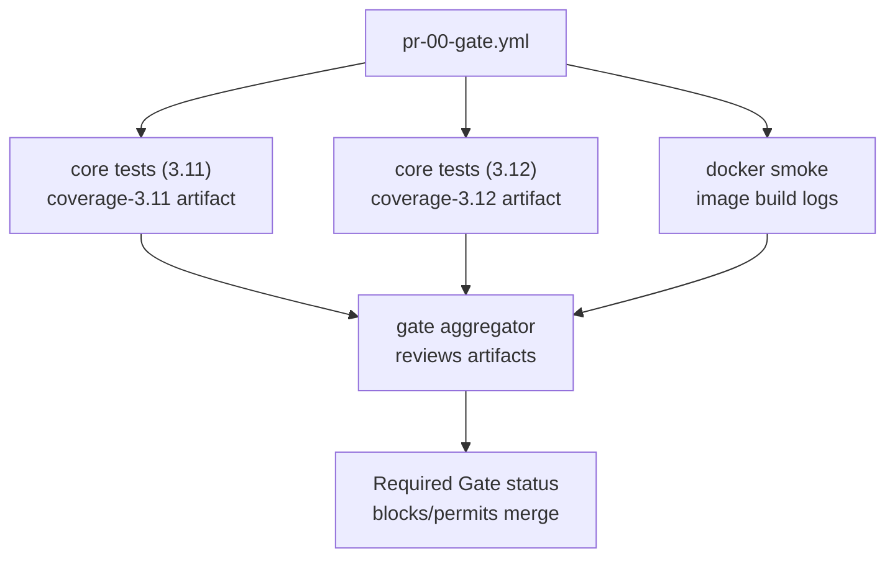

# Workflow Catalog & Contributor Quick Start

Use this page as the canonical reference for CI workflow naming, inventory, and
local guardrails. It consolidates the requirements from Issues #2190, #2202,
and #2466. Gate remains the required merge check for every pull request, and
**Agents 70 Orchestrator is the sole supported automation entry point**. All
automation routes through that workflow; retired shims are preserved solely in
the archival ledger for historical reference.

> ℹ️ **Scope.** This catalog lists active workflows only. Historical entries and
> verification notes live in [ARCHIVE_WORKFLOWS.md](../../ARCHIVE_WORKFLOWS.md).

Start with the [Workflow System Overview](WORKFLOW_SYSTEM.md) for the
bucket-level summary, keep vs retire roster, and policy checklist. Return here
for the detailed trigger, permission, and operational notes per workflow.

## CI & agents quick catalog

The tables below capture the **active** workflows, their triggers, required
scopes, and whether they block merges. Retired entries move to the
[archived roster](#archived-workflows) once deleted so contributors can locate
history without confusing it with the live inventory.

### Required merge gate

| Workflow | File | Trigger(s) | Permissions | Required? | Purpose |
| --- | --- | --- | --- | --- | --- |
| **Gate** | `.github/workflows/pr-00-gate.yml` | `pull_request`, `workflow_dispatch` | Explicit `contents: read`, `pull-requests: write`, `statuses: write` (doc-only comment + commit status). | **Yes** – aggregate `gate` status must pass. | Fan-out orchestrator chaining the reusable Python CI and Docker smoke jobs. Docs-only or empty diffs skip the heavy legs while Gate posts the friendly notice and reports success. |

#### Gate job map

Use this map when triaging Gate failures. It illustrates the jobs that run on
every pull request, which artifacts each produces, and how the final `gate`
enforcement step evaluates their results.

| Job ID | Display name | Purpose | Artifacts / outputs | Notes |
| --- | --- | --- | --- | --- |
| `core-tests-311` | core tests (3.11) | Runs Ruff, Mypy, and pytest against Python 3.11 via `reusable-10-ci-python.yml`. | `coverage-3.11` (coverage data and pytest junit XML). | Fails fast on lint/type/test issues; publishes coverage for Maint 46 Post CI rollups. |
| `core-tests-312` | core tests (3.12) | Reuses the Python composite for the 3.12 matrix leg. | `coverage-3.12` (coverage data and pytest junit XML). | Keeps the repo aligned with the future default Python runtime. |
| `docker-smoke` | docker smoke | Builds the project image and executes the smoke command through `reusable-12-ci-docker.yml`. | None (logs only). | Ensures packaging basics work before merge. |
| `gate` | gate | Downloads successful coverage artifacts and renders the pull-request summary table. | Job summary with pass/fail table. | Hard-fails if any upstream job did not succeed; this status is the required merge check. |



### Label-gated PR automation

| Workflow | File | Trigger(s) | Permissions | Required? | Purpose |
| --- | --- | --- | --- | --- | --- |
| **PR 02 Autofix** | `.github/workflows/pr-02-autofix.yml` | `pull_request` (including label updates) | `contents: write`, `pull-requests: write` | **No** – runs only when the `autofix` label (or override) is present. | Delegates to `reusable-18-autofix.yml` to apply or upload safe formatting fixes. |

**Operational details**
- **Autofix** – Permissions: `contents: write`, `pull-requests: write`. Secrets: inherits `GITHUB_TOKEN` (sufficient for label
  and comment updates). When the label is present it pushes low-risk fixes for same-repo branches or uploads a patch artifact for
  forks, then updates cleanliness labels (`autofix:clean` / `autofix:debt`).

### Maintenance & observability

| Workflow | File | Trigger(s) | Permissions | Required? | Purpose |
| --- | --- | --- | --- | --- | --- |
| **Maint 46 Post CI** | `.github/workflows/maint-46-post-ci.yml` | `workflow_run` (Gate) | `contents: write`, `pull-requests: write`, `issues: write`, `checks: read`, `actions: read` | No | Consolidated follower that posts Gate summaries, applies low-risk autofix commits or uploads patches, and maintains the CI failure-tracker issue. |
| **Maint 45 Cosmetic Repair** | `.github/workflows/maint-45-cosmetic-repair.yml` | `workflow_dispatch` | `contents: write`, `pull-requests: write` | No | Manual pytest + guardrail fixer that opens a labelled PR when drift is detected. |
| **Health 41 Repo Health** | `.github/workflows/health-41-repo-health.yml` | Monday cron (`15 7 * * 1`), `workflow_dispatch` | `contents: read`, `issues: read` | No | Weekly stale-branch and unassigned-issue sweep. |
| **Health 40 Repo Selfcheck** | `.github/workflows/health-40-repo-selfcheck.yml` | Weekly cron (`20 6 * * 1`), `workflow_dispatch` | `contents: read`, `issues: read`, `pull-requests: read`, `actions: read` | No | Read-only probe summarising label coverage and branch-protection visibility. |
| **Health 42 Actionlint** | `.github/workflows/health-42-actionlint.yml` | `pull_request`, `push` to `phase-2-dev` (workflow edits), weekly cron, `workflow_dispatch` | `contents: read`, `pull-requests: write`, `checks: write` | No | Workflow-lint gate using `actionlint` via reviewdog. |
| **Health 43 CI Signature Guard** | `.github/workflows/health-43-ci-signature-guard.yml` | `push`/`pull_request` targeting `phase-2-dev` | Defaults (`contents: read`) | No | Validates the signed job manifest for Gate. |
| **Health 44 Gate Branch Protection** | `.github/workflows/health-44-gate-branch-protection.yml` | Cron (`0 6 * * *`), `workflow_dispatch` | `contents: read`, `pull-requests: read`; optional `BRANCH_PROTECTION_TOKEN` | No | Verifies Gate remains required on the default branch; optionally enforces policy when a PAT is configured. |

### Self-tests & experiments

| Workflow | File | Trigger(s) | Permissions | Required? | Purpose |
| --- | --- | --- | --- | --- | --- |
| **Selftest 81 Reusable CI** | `.github/workflows/selftest-81-reusable-ci.yml` | `workflow_dispatch`, `workflow_call` | `contents: read`, `actions: read` | No | Reusable CI matrix exerciser that exposes verification outputs for downstream consumers and manual runs. |
| **Selftest Runner** | `.github/workflows/selftest-runner.yml` | `workflow_dispatch` | `contents: read`, `actions: read`, `pull-requests: write` | No | Parameterised manual entry point for the reusable matrix (modes: summary, comment, dual-runtime) with optional PR comment output and artifact downloads. |

When running the consolidated runner choose a `mode` (`summary`, `comment`, or `dual-runtime`) and pair it with the desired
`post_to` target. Comment mode requires setting `post_to: pr-number` and providing `pull_request_number`; the workflow validates
the value and updates a single deduplicated comment marked `<!-- selftest-runner-comment -->`. Toggle `enable_history: true`
when you need to download the `selftest-report` artifact emitted by the reusable matrix for local inspection.

### Agents & automation

| Workflow | File | Trigger(s) | Permissions | Required? | Purpose |
| --- | --- | --- | --- | --- | --- |
| **Agents 70 Orchestrator** | `.github/workflows/agents-70-orchestrator.yml` | Cron (`*/20 * * * *`), `workflow_dispatch` | `contents: write`, `pull-requests: write`, `issues: write`; optional `service_bot_pat` | No | Single supported entry point dispatching readiness, bootstrap, diagnostics, verification, and keepalive routines. |
| **Agents 63 Codex Issue Bridge** | `.github/workflows/agents-63-codex-issue-bridge.yml` | `issues`, `workflow_dispatch` | `contents: write`, `pull-requests: write`, `issues: write` | No | Label-driven helper that seeds Codex bootstrap PRs and can auto-comment `@codex start`. |
| **Agents 64 Verify Agent Assignment** | `.github/workflows/agents-64-verify-agent-assignment.yml` | `workflow_call`, `workflow_dispatch` | `issues: read` | No | Reusable issue-verification helper consumed by the orchestrator and available for ad-hoc checks. |
| **Agents 63 ChatGPT Issue Sync** | `.github/workflows/agents-63-chatgpt-issue-sync.yml` | `workflow_dispatch` | `contents: read`, `issues: write` | No | Manual sync that turns curated topic lists (e.g. `Issues.txt`) into labelled GitHub issues. |

### Reusable composites

| Workflow | File | Trigger(s) | Permissions | Required? | Purpose |
| --- | --- | --- | --- | --- | --- |
| **Reusable CI** | `.github/workflows/reusable-10-ci-python.yml` | `workflow_call` | Inherits caller permissions | No | Python lint/type/test reusable consumed by Gate and downstream repositories. |
| **Reusable Docker Smoke** | `.github/workflows/reusable-12-ci-docker.yml` | `workflow_call` | Inherits caller permissions | No | Docker build + smoke reusable consumed by Gate and external callers. |
| **Reusable 18 Autofix** | `.github/workflows/reusable-18-autofix.yml` | `workflow_call` | `contents: write`, `pull-requests: write` | No | Autofix harness shared by `pr-02-autofix.yml` and `maint-46-post-ci.yml`. |
| **Reusable 16 Agents** | `.github/workflows/reusable-16-agents.yml` | `workflow_call` | `contents: write`, `pull-requests: write`, `issues: write`; optional `service_bot_pat` | No | Sole agents composite implementing readiness, bootstrap, diagnostics, keepalive, and watchdog jobs for all callers. |

## Archived workflows

Workflows removed during the consolidation now live only in git history. Refer to
[ARCHIVE_WORKFLOWS.md](../../ARCHIVE_WORKFLOWS.md) for the authoritative ledger
of retired entries, the keep vs retire roster, and verification notes.

## Naming Policy & Number Ranges

- Store workflows under `.github/workflows/` and follow the
  `<area>-<NN>-<slug>.yml` convention.
- Reserve number bands per area so future additions remain grouped:

  | Prefix | Number slots | Usage | Notes |
  |--------|--------------|-------|-------|
  | `pr-` | `10–19` | Pull-request gates | `pr-00-gate.yml` is the primary orchestrator; use remaining slots for future gate helpers as needed.
  | `maint-` | `00–49` and `90s` | Scheduled/background maintenance | Low numbers for repo hygiene, 30s/40s for post-CI and guards, 90 for self-tests calling reusable matrices.
  | `agents-` | `70s` | Agent bootstrap/orchestration | `agents-70-orchestrator.yml` handles automation cadences.
  | `reusable-` | `10–29` | Composite workflows invoked by others | Lower slots (10s/20s) host shared CI, autofix, and agents toolkit workflows.

- Match the `name:` field to the filename rendered in Title Case
  (`pr-00-gate.yml` → `Gate`).
- `tests/test_workflow_naming.py` enforces this policy—rerun it after modifying
  or adding workflows.
- When introducing a new workflow choose the lowest unused slot inside the
  appropriate band, update this document, and add the workflow to the relevant
  section below.

## Workflow Inventory

### Required PR gates (block merges by default)

| Workflow | File | Trigger(s) | Permissions | Required? | Why it matters |
|----------|------|------------|-------------|-----------|----------------|
| `pr-00-gate.yml` (`Gate`) | `.github/workflows/pr-00-gate.yml` | `pull_request`, `workflow_dispatch` | `contents: read`, `pull-requests: write`, `statuses: write` | **Yes** | Composite orchestrator that chains the reusable CI and Docker smoke jobs and enforces that every leg succeeds. |

**Operational details**
- **Gate** – Permissions: `contents: read`, `pull-requests: write`, `statuses: write` (via the default `GITHUB_TOKEN`). Secrets: relies on the provided token only. The `detect_doc_only` job classifies Markdown/`docs/`/`assets/` changes, skips the heavy CI legs when appropriate, posts the docs-only notice, and otherwise surfaces `core tests (3.11)`, `core tests (3.12)`, `docker smoke`, and the aggregator `gate` job.


| Workflow | File | Trigger(s) | Permissions | Required? | Purpose |
|----------|------|------------|-------------|-----------|---------|
| `health-41-repo-health.yml` (`Health 41 Repo Health`) | `.github/workflows/health-41-repo-health.yml` | Weekly cron, manual | `contents: read`, `issues: read` | No | Reports stale branches & unassigned issues. |
| `maint-46-post-ci.yml` (`Maint 46 Post CI`) | `.github/workflows/maint-46-post-ci.yml` | `workflow_run` (Gate) | `contents: write`, `pull-requests: write`, `issues: write`, `checks: read`, `actions: read` | No | Consolidated follower that posts Gate summaries, applies low-risk autofix commits, and owns CI failure-tracker updates. |
| `health-40-repo-selfcheck.yml` (`Health 40 Repo Selfcheck`) | `.github/workflows/health-40-repo-selfcheck.yml` | Weekly cron, manual | `contents: read`, `issues: read`, `pull-requests: read`, `actions: read` | No | Read-only repo health pulse that surfaces missing labels or branch-protection visibility gaps in the step summary. |
| `health-44-gate-branch-protection.yml` (`Health 44 Gate Branch Protection`) | `.github/workflows/health-44-gate-branch-protection.yml` | Hourly cron, manual | `contents: read`, `pull-requests: read`; optional PAT via `BRANCH_PROTECTION_TOKEN` | No | Applies branch-protection policy checks using `tools/enforce_gate_branch_protection.py`; skips gracefully when the PAT is not configured. |
| `health-42-actionlint.yml` (`Health 42 Actionlint`) | `.github/workflows/health-42-actionlint.yml` | `pull_request`, weekly cron, manual | `contents: read`, `pull-requests: write`, `checks: write` | No | Sole workflow-lint gate (actionlint via reviewdog). |
| `health-43-ci-signature-guard.yml` (`Health 43 CI Signature Guard`) | `.github/workflows/health-43-ci-signature-guard.yml` | `push`/`pull_request` targeting `phase-2-dev` | Defaults (`contents: read`) | No | Validates the signed job manifest for `pr-00-gate.yml`. |
| `agents-63-chatgpt-issue-sync.yml` (`Agents 63 ChatGPT Issue Sync`) | `.github/workflows/agents-63-chatgpt-issue-sync.yml` | `workflow_dispatch` (manual) | `contents: read`, `issues: write` | No | Fans out curated topic lists (e.g. `Issues.txt`) into labeled GitHub issues. ⚠️ Repository policy: do not remove without a functionally equivalent replacement. |
| `maint-45-cosmetic-repair.yml` (`Maint 45 Cosmetic Repair`) | `.github/workflows/maint-45-cosmetic-repair.yml` | `workflow_dispatch` | `contents: write`, `pull-requests: write` | No | Manual pytest + guardrail fixer that applies tolerance/snapshot updates and opens a labelled PR when drift is detected. |


- **Symptom:** `Health 41 Repo Health` or `Health 40 Repo Selfcheck` stops with `Resource not accessible by integration` or warns that branch protection visibility is missing.
- **Remedies:**
  1. Confirm the repository setting **Settings → Actions → General → Workflow permissions** grants the default token _Read access to contents and metadata_. The repo-health jobs use only read scopes.
   2. If the default token still cannot read branch protection, rerun **Health 44 Gate Branch Protection** with a `BRANCH_PROTECTION_TOKEN` that has `repo` scope. The verification step will surface the current policy and unblock Health 40 on the next scheduled run.
  3. Escalate to a repository admin if neither step restores access—the repo-health jobs cannot self-grant elevated scopes.

### CI failure rollup issue

`Maint 46 Post CI` maintains **one** open issue labelled `ci-failure` that aggregates "CI failures in the last 24 h". The failure-tracker job updates the table in place with each Gate failure, links the offending workflow run, and closes the issue automatically once the inactivity threshold elapses. The issue carries labels `ci`, `devops`, and `priority: medium`; escalations add `priority: high` when the same signature trips three times. Use this issue for a quick dashboard of outstanding CI problems instead of scanning individual PR timelines.

### Agent automation entry points

`agents-70-orchestrator.yml` (`Agents 70 Orchestrator`) is the scheduled automation entry point. It runs on a 20-minute cron and can also be dispatched manually. Both methods call the reusable agents toolkit to perform readiness probes, Codex bootstrap, diagnostics, verification, and keepalive sweeps. New automation should call the orchestrator directly.

The Codex Issue Bridge is a label-driven helper for seeding bootstrap PRs, while `agents-64-verify-agent-assignment.yml` exposes the verification logic as a reusable workflow-call entry point that the orchestrator consumes.

**Operational details**
- Provide required write scopes via the default `GITHUB_TOKEN`. Supply `service_bot_pat` when bootstrap jobs must push branches or leave comments.
- Use the `options_json` input to enable bootstrap (for example `{ "enable_bootstrap": true, "bootstrap": { "label": "agent:codex" } }`) or pass additional toggles such as keepalive overrides. The orchestrator parses the JSON via `fromJson()` and forwards the resolved values to `reusable-16-agents.yml`.
- Readiness, preflight, bootstrap, verification, and keepalive diagnostics appear in the job summary. Failures bubble up through the single `orchestrate` job; Maint 46 Post CI will echo the failing run link in the CI failure-tracker issue when the Gate is affected.

### Manual Orchestrator Dispatch

1. Navigate to **Actions → Agents 70 Orchestrator → Run workflow**.
2. Fill the dispatch form:
   - **Branch**: keep `phase-2-dev` unless testing a feature branch.
   - **Enable readiness / preflight / watchdog**: toggle as needed for the run.
   - **Verify issue fields**: provide `enable_verify_issue`, `verify_issue_number`, and `verify_issue_valid_assignees` when
     running the assignment audit path.
   - **Enable bootstrap**: set to `true` when seeding Codex PRs; leave `false` for readiness-only sweeps.
   - **Options JSON**: supply nested overrides (for example `{ "bootstrap": { "label": "agent:codex" }, "diagnostic_mode": "dry-run", "require_all": true }`).
3. Click **Run workflow**. The orchestrator fan-outs through `reusable-16-agents.yml`; job summaries include readiness tables, bootstrap status, verification notes, and links to spawned PRs.
4. When verification is enabled and succeeds, the `verify-assignment-summary` step appends the matched assignee and status to the run summary so operators can confirm which automation satisfied the check.

**Programmatic dispatch (`options_json` example).** Tooling can post the JSON payload directly through the orchestrator’s `options_json` input. When migrating older integrations, convert their legacy `params_json` blob into the orchestrator format before dispatching.

```json
{
  "enable_readiness": true,
  "readiness_agents": "copilot,codex",
  "enable_preflight": true,
  "codex_user": "",
  "enable_verify_issue": true,
  "verify_issue_number": "123456",
  "verify_issue_valid_assignees": "copilot,chatgpt-codex-connector,stranske-automation-bot",
  "enable_bootstrap": true,
  "bootstrap_issues_label": "agent:codex",
  "draft_pr": false,
  "options_json": "{\"require_all\":true,\"diagnostic_mode\":\"dry-run\",\"bootstrap\":{\"label\":\"agent:codex\"}}"
}
```

Example CLI flow:

```bash
cat <<'JSON' > orchestrator.json
{
  "enable_readiness": true,
  "readiness_agents": "copilot,codex",
  "enable_preflight": true,
  "codex_user": "",
  "enable_verify_issue": true,
  "verify_issue_number": "123456",
  "verify_issue_valid_assignees": "copilot,chatgpt-codex-connector,stranske-automation-bot",
  "enable_bootstrap": true,
  "bootstrap_issues_label": "agent:codex",
  "draft_pr": false,
  "options_json": "{\"require_all\":true,\"diagnostic_mode\":\"dry-run\",\"bootstrap\":{\"label\":\"agent:codex\"}}"
}
JSON

gh workflow run agents-70-orchestrator.yml \
  --ref phase-2-dev \
  --raw-field options_json="$(cat orchestrator.json)"

# Using the REST API with curl (requires a PAT that can dispatch workflows)
curl -X POST \
  -H "Authorization: token ${GITHUB_TOKEN}" \
  -H "Accept: application/vnd.github+json" \
  -H "Content-Type: application/json" \
  https://api.github.com/repos/stranske/Trend_Model_Project/actions/workflows/agents-70-orchestrator.yml/dispatches \
  -d @<(jq -nc \
    --arg ref "phase-2-dev" \
  --arg options "$(cat orchestrator.json)" \
  '{ref: $ref, inputs: {options_json: $options}}')
```

Export `GITHUB_TOKEN` to a PAT or workflow token that can dispatch workflows before running the command above. Mix and match the JSON payload with individual dispatch inputs when overrides are required (for example add `--raw-field enable_readiness=false` to override the JSON flag). Upstream automation that still emits `params_json` must be updated to provide the orchestrator’s `options_json` payload directly.

> **Prerequisites:** The CLI example assumes the GitHub CLI is installed and authenticated. The REST variant relies on `jq` and Bash process substitution (`@<()`); on macOS install `jq` via Homebrew and run the command inside a shell that supports process substitution (e.g. `bash`, `zsh`). Windows users can adapt the payload generation by writing the JSON to a temporary file and referencing it with `--data @file.json` instead.

### Agent troubleshooting: bootstrap & readiness signals

| Symptom | Likely cause | Where to look | Remedy |
| ------- | ------------ | ------------- | ------ |
| Readiness probe fails immediately | Missing PAT or permissions | `orchestrate` job summary → “Authentication” step | Provide `SERVICE_BOT_PAT` secret or rerun with reduced scope. |
| Bootstrap skipped despite `enable_bootstrap` | No matching labelled issues | Job summary → “Bootstrap Planner” table | Add `agent:codex` label (or configured label) to target issues, rerun. |
| Bootstrap run exits with “Repository dirty” | Prior automation left branches open | Job log → `cleanup` step | Manually close stale branches or enable cleanup via the `options_json` payload (set `{ "cleanup": { "force": true } }`). Ensure any legacy callers wrap their payload inside the `options_json` key before dispatch. |
| Readiness succeeds but Codex PR creation fails | Repository protections blocking pushes | Job log → `Create bootstrap branch` step | Ensure branch protection rules allow the automation account or supply a PAT with required scopes. |

Escalate persistent failures by linking the failing run URL in the CI failure-tracker issue managed by Maint 46 Post CI.

### Gate pipeline overview

| Stage | Job ID (Gate) | Artifacts / Outputs | Enforcement & Notes |
|-------|---------------|---------------------|---------------------|
| Python quality (3.11) | `core tests (3.11)` | Uploads `coverage-3.11` artifact (coverage XML + pytest reports). Step summary links to Ruff, mypy, and pytest failures. | Required leg. Failing tests block the Gate aggregator and surface immediately in Maint 46 Post CI summaries. |
| Python quality (3.12) | `core tests (3.12)` | Uploads `coverage-3.12` artifact mirroring the 3.11 layout for comparison. | Required leg. Treat regressions here as parity alerts; Maint 46 Post CI highlights mismatched coverage deltas. |
| Docker smoke | `docker smoke` | Emits Docker build logs and smoke-test output inside the job summary. No persistent artifact. | Required leg. Validates the container build and basic runtime; failures block the Gate aggregator. |
| Aggregator | `gate` | Writes Markdown status table summarising upstream results. Downloads coverage artifacts when available. | Enforces final merge requirement by exiting non-zero if any dependency failed. Maint 46 Post CI reads this status to update the CI failure-tracker issue. |

**Post-change monitoring.** When agent workflows change:

- Tag the source issue with `ci-failure` so it stays visible during the observation window.
- Coordinate a 48-hour watch to confirm only `agents-70-orchestrator.yml` runs (manual dispatch or cron). Investigate any automation attempting to dispatch undocumented workflows and redirect it to the orchestrator.
- Capture a brief note or screenshot of the clean Actions history before removing the tag and closing the issue.

Manual-only status means maintainers should review the Actions list during that window to ensure no unexpected cron trigger resumes.

### Reusable composites

| Workflow | Consumed by | Notes |
|----------|-------------|-------|
| `reusable-16-agents.yml` (`Reusable 16 Agents`) | `agents-70-orchestrator.yml`, downstream repositories | Implements readiness, bootstrap, diagnostics, keepalive, and watchdog jobs.
| `reusable-18-autofix.yml` (`Reusable 18 Autofix`) | `maint-46-post-ci.yml`, `pr-02-autofix.yml` | Autofix harness used both by the PR-time autofix workflow and the post-CI maintenance listener.
| `reusable-10-ci-python.yml` (`Reusable CI`) | Gate, downstream repositories | Single source for Python lint/type/test coverage runs.
| `reusable-12-ci-docker.yml` (`Reusable Docker Smoke`) | Gate, downstream repositories | Docker build + smoke reusable consumed by Gate and external callers.

**Operational details**
- **Reusable 16 Agents** – Permissions: `contents: write`, `pull-requests: write`, `issues: write`. Secrets: optional `service_bot_pat` (forwarded to downstream jobs) plus `GITHUB_TOKEN`. Outputs: per-job readiness tables, bootstrap activity summaries, keepalive sweep details, and watchdog notes surfaced via job summaries and declared workflow outputs.

### Manual self-test examples

| Workflow | Notes |
|----------|-------|
| `selftest-81-reusable-ci.yml` (`Selftest 81 Reusable CI`) | Core reusable self-test matrix. Available both for manual dispatch and as a `workflow_call` target for the consolidated runner. |
| `selftest-runner.yml` (`Selftest Runner`) | Single manual wrapper that toggles summary vs PR comment output and the Python version matrix via `mode` inputs. |

> Self-test workflows are reference exercises for maintainers. They are quiet by design—trigger them via `workflow_dispatch` (or, for wrappers, specify the PR number/inputs) whenever you need a fresh artifact inventory check or to validate reusable CI changes. Expect no automated executions in the Actions history.

## Contributor Quick Start

Follow this sequence before pushing workflow changes or large code edits:

1. **Install tooling** – run `./scripts/setup_env.sh` once to create a virtual environment with repository requirements.
2. **Mirror the CI style gate locally** – execute:

   ```bash
   ./scripts/style_gate_local.sh
   ```

   The script sources `.github/workflows/autofix-versions.env`, installs the pinned formatter/type versions, runs Ruff/Black, and finishes with a mypy pass over `src/trend_analysis` and `src/trend_portfolio_app`. Fix any reported issues to keep the Gate workflow green.
3. **Targeted tests** – add `pytest tests/test_workflow_naming.py` after editing workflow files to ensure naming conventions hold. For agents changes, also run `pytest tests/test_automation_workflows.py -k agents`.
4. **Optional smoke** – `gh workflow list --limit 20` validates that only the documented workflows surface in the Actions tab.

## Adding or Renumbering Workflows

1. Pick the correct prefix/number band (see Naming Policy) and choose the lowest unused slot.
   - Treat the `NN` portion as a zero-padded two-digit identifier within the band (`pr-10`, `maint-36`, etc.). Check the tables above before reusing a number so future contributors can infer gaps at a glance.
2. Place the workflow in `.github/workflows/` with the matching Title Case `name:`.
3. Update any trigger dependencies (`workflow_run` consumers) so maintenance jobs continue to listen to the correct producers.
4. Document the change in this file (inventory tables + bands) and in `docs/WORKFLOW_GUIDE.md` if the topology shifts.
5. Run the validation commands listed above before opening a PR.

## Formatter & Type Checker Pins

- `.github/workflows/autofix-versions.env` is the single source of truth for
  formatter/type tooling versions (Ruff, Black, isort, docformatter, mypy).
- `reusable-10-ci-python.yml`, `reusable-12-ci-docker.yml`, and the autofix composite
  action all load and validate this env file before installing tools; they fail
  fast if the file is missing or incomplete.
- Local mirrors (`scripts/style_gate_local.sh`, `scripts/dev_check.sh`,
  `scripts/validate_fast.sh`) source the same env file so contributors run the
  identical versions before pushing.
- When bumping any formatter, update the env file first, rerun
  `./scripts/style_gate_local.sh`, and let CI confirm the new version to keep
  automation and local flows aligned.

## CI Signature Guard Fixtures

`health-43-ci-signature-guard.yml` enforces a manifest signature for the Gate workflow by comparing two fixture files stored in `.github/signature-fixtures/`:

- `basic_jobs.json` – canonical list of jobs (name, concurrency label, metadata)
  that must exist in `pr-00-gate.yml`.
- `basic_hash.txt` – precomputed hash of the JSON payload used by
  `.github/actions/signature-verify` to detect unauthorized job changes.

When intentionally editing CI jobs, regenerate `basic_jobs.json`, compute the new hash, and update both files in the same commit. Use `tools/test_failure_signature.py` locally to recompute and verify the hash before pushing. The guard only runs on pushes/PRs targeting `phase-2-dev` and publishes a step summary linking back here.

## Agents `params_json` Schema

`agents-70-orchestrator.yml` accepts the standard dispatch inputs shown in the workflow plus an extensible JSON payload routed through `params_json`. The JSON is parsed with `fromJson()` and handed to the reusable agents workflow. Nested automation knobs can be forwarded via the optional `options_json` string when the reusable composite expects more structured data.

```jsonc
{
  "enable_bootstrap": true,
  "bootstrap_issues_label": "agent:codex",
  "diagnostic_mode": "dry-run",
  "readiness_custom_logins": "login-a,login-b",
  "codex_command_phrase": "@codex start",
  "options_json": "{\"enable_keepalive\":false}"
}
```

- **`enable_bootstrap` / `bootstrap_issues_label`** — toggle Codex bootstrap and override the label scanned for candidate issues.
- **`diagnostic_mode`** — `off` (default) disables diagnostics, `dry-run` keeps bootstrap logic read-only, `full` allows branch creation and sets `draft_pr: false` when Codex is seeded.
- **`readiness_custom_logins`** — comma-separated list for additional readiness probes.
- **`codex_command_phrase`** — phrase used when the orchestrator comments on issues or PRs to summon Codex.
- **`options_json`** — pass-through blob for nested settings such as keepalive thresholds or cleanup toggles (see Gate troubleshooting table above).

Keep this schema backward compatible; add new keys sparingly and document them here when introduced.
