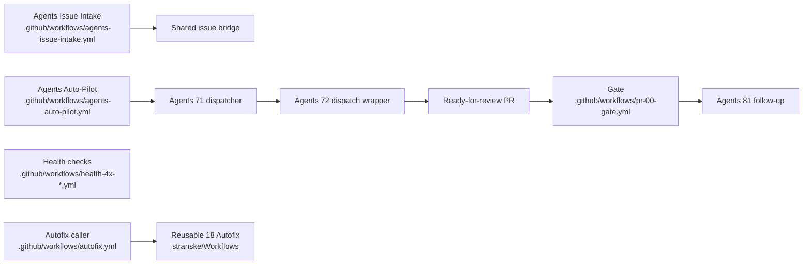
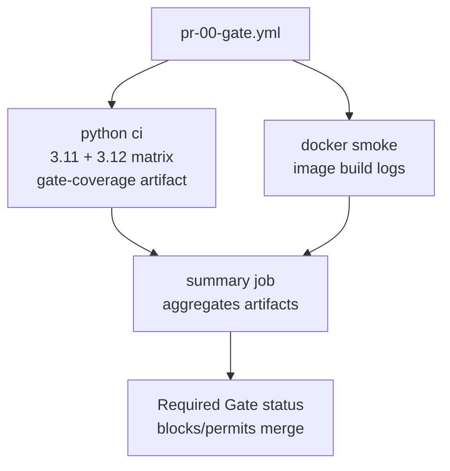

# CI Workflow Layout

This page captures the target layout for the automation that protects pull requests, heals small issues, and keeps the repository health checks aligned. Each section links directly to the workflow definitions so future changes can trace how the pieces fit together.

> ℹ️ **Scope.** This catalog lists active workflows only. Historical entries and
> verification notes live in [ARCHIVE_WORKFLOWS.md](../archive/ARCHIVE_WORKFLOWS.md).

## Target layout

```mermaid
flowchart LR
    intake["Agents Issue Intake\n.github/workflows/agents-issue-intake.yml"] --> bridge["Shared issue bridge"]
    autoPilot["Agents Auto-Pilot\n.github/workflows/agents-auto-pilot.yml"] --> dispatcher["Agents 71 dispatcher"] --> workerDispatch["Agents 72 dispatch wrapper"]
    workerDispatch --> readyPr["Ready-for-review PR"] --> gate["Gate\n.github/workflows/pr-00-gate.yml"] --> gateFollowups["Agents 81 follow-up"]
    healthGuard["Health checks\n.github/workflows/health-4x-*.yml"]
    autofixCaller["Autofix caller\n.github/workflows/autofix.yml"] --> autofix["Reusable 18 Autofix\nstranske/Workflows"]
```

- **PR checks:** [Gate](../../.github/workflows/pr-00-gate.yml) fans out to the reusable Python CI matrix and Docker smoke tests before its inline `summary` job publishes the commit status and PR comment. The **Gate summary job** keeps that follow-up comment updated with the latest artifacts.
- **Autofix path:** When invoked directly, [Reusable 18 Autofix](../../.github/workflows/reusable-18-autofix.yml) can stage hygiene fixes or generate patch artifacts; it is no longer triggered automatically after Gate completes.
- **Agents control plane:** [Agents Issue Intake](../../.github/workflows/agents-issue-intake.yml) handles assignment-shaped agent labels, filters metadata-only labels, and supports manual bootstrap. [Agents Auto-Pilot](../../.github/workflows/agents-auto-pilot.yml) invokes the dispatchable Agents 71 selector and Agents 72 wrapper for end-to-end issues. [Agents 81](../../.github/workflows/agents-81-gate-followups.yml) owns active guarded post-Gate delivery, while [Agents Keepalive Sweep](../../.github/workflows/agents-keepalive-sweep.yml) periodically re-evaluates stalled non-draft agent PRs.
- **Health checks:** The [Health 4x suite](../../.github/workflows/health-40-repo-selfcheck.yml), [Health 40 Sweep](../../.github/workflows/health-40-sweep.yml), [Health 41](../../.github/workflows/health-41-repo-health.yml), [Health 42](../../.github/workflows/health-42-actionlint.yml), [Health 43](../../.github/workflows/health-43-ci-signature-guard.yml), [Health 44](../../.github/workflows/health-44-gate-branch-protection.yml), and [Health 50 Security Scan](../../.github/workflows/health-50-security-scan.yml) workflows provide scheduled drift detection, enforcement snapshots, and security scanning.

Start with the [Workflow System Overview](WORKFLOW_SYSTEM.md) for the
bucket-level summary, the [keep vs retire roster](WORKFLOW_SYSTEM.md#final-topology-keep-vs-retire), and policy checklist. Return
here for the detailed trigger, permission, and operational notes per workflow.

## CI & agents quick catalog

The tables below capture the **active** workflows, their triggers, required
scopes, and whether they block merges. Retired entries move to the
[archived roster](#archived-workflows) once deleted so contributors can locate
history without confusing it with the live inventory.

### Required merge gate

| Workflow | File | Trigger(s) | Permissions | Required? | Purpose |
| --- | --- | --- | --- | --- | --- |
| **Gate** | `.github/workflows/pr-00-gate.yml` | `pull_request`, `workflow_dispatch` | Explicit `contents: read`, `pull-requests: write`, `statuses: write` (doc-only comment + commit status). | **Yes** – aggregate `gate` status must pass. | Fan-out orchestrator chaining the reusable Python CI and Docker smoke jobs. Docs-only or empty diffs skip the heavy legs while Gate posts the friendly notice and reports success. |
| **Minimal invariant CI** | `.github/workflows/pr-11-ci-smoke.yml` | `push`/`pull_request` targeting `main`, `workflow_dispatch` | `contents: read` | **No** – supplemental smoke test. | Single-runtime Python 3.14 import + invariants sweep (`pytest tests/test_invariants.py -q`) that catches regressions quickly while Gate runs the heavier matrix. |
| **Fund selector Playwright smoke** | `.github/workflows/pr-12-playwright.yml` | `push`/`pull_request` targeting `main`, `workflow_dispatch` | `contents: read` | **No** – supplemental E2E check. | Runs a small Playwright smoke against the Streamlit fund selector so UI regressions are caught early. |

#### Gate job map

Use this map when triaging Gate failures. It illustrates the jobs that run on
every pull request, which artifacts each produces, and how the final `gate`
enforcement step evaluates their results.

| Job ID | Display name | Purpose | Artifacts / outputs | Notes |
| --- | --- | --- | --- | --- |
| `python-ci` | python ci | Invokes `reusable-10-ci-python.yml` once with a 3.11 + 3.12 matrix. Runs Ruff, Mypy (on the pinned runtime), pytest with coverage, and emits structured summaries. | `gate-coverage`, `gate-coverage-summary`, `gate-coverage-trend` (primary runtime). | Single source of lint/type/test/coverage truth. Coverage payloads share the `gate-coverage` artifact under `coverage/runtimes/<python>` for downstream consumers. |
| `docker-smoke` | docker smoke | Builds the project image and executes the smoke command through `reusable-12-ci-docker.yml`. | None (logs only). | Ensures packaging basics work before merge. |
| `summary` | summary | Aggregates lint/type/test/coverage results, computes deltas, uploads `gate-summary.md`, and maintains the consolidated PR comment. | Job summary, `gate-summary.md`, `gate-coverage.json`, `gate-coverage-delta.json`, `gate-coverage-summary.md`. | Posts the required `Gate / gate` status and enforces failure when upstream legs are unhealthy. |

```mermaid
flowchart TD
    pr00["pr-00-gate.yml"] --> pythonCi["python ci\n3.11 + 3.12 matrix\n gate-coverage artifact"]
    pr00 --> dockerSmoke["docker smoke\nimage build logs"]
    pythonCi --> summaryJob["summary job\naggregates artifacts"]
    dockerSmoke --> summaryJob
    summaryJob --> status["Required Gate status\nblocks/permits merge"]
```
pull_request ──▶ Gate ──▶ Summary comment & status
                    └─▶ Reusable test suites (Python matrix & Docker smoke)

## Pull Request Gate

* [`Gate`](../../.github/workflows/pr-00-gate.yml) orchestrates the fast-path vs full CI decision, evaluates coverage artifacts, and reports commit status back to the PR.
* [`Minimal invariant CI`](../../.github/workflows/pr-11-ci-smoke.yml) supplies the lightweight Issue #3651 sweep: install once on Python 3.14 with pip caching, sanity-check imports, and run `pytest tests/test_invariants.py -q` on both pushes and PRs targeting `main`.
* [`Fund selector Playwright smoke`](../../.github/workflows/pr-12-playwright.yml) runs a Playwright E2E smoke for the fund selection flow on pushes and PRs targeting `main`.
* [`Reusable CI (Python)`](../../.github/workflows/reusable-10-ci-python.yml) drives the primary test matrix (lint, type-check, tests, coverage) for PR builds.
* [`Reusable CI (Docker)`](../../.github/workflows/reusable-12-ci-docker.yml) executes the container smoke test whenever Docker-related files change.

The gate uses the shared `.github/scripts/detect-changes.js` helper to decide when documentation-only changes can skip heavy jobs and when Docker smoke tests must run.

## Coverage Guardrails & Follow-ups

* Gate’s `summary` job now emits the consolidated PR comment, uploads `gate-summary.md`, and publishes `gate-coverage.json` / `gate-coverage-delta.json` for downstream consumers.
* [`maint-coverage-guard.yml`](../../.github/workflows/maint-coverage-guard.yml) periodically verifies that the latest Gate run meets baseline coverage expectations.
* [`maint-46-post-ci.yml`](../../.github/workflows/maint-46-post-ci.yml) wakes up after Gate completes, validates the workflow syntax with `actionlint`, downloads the Gate artifacts, renders the consolidated CI summary (including coverage deltas), and republishes the Gate commit status while saving a markdown preview for evidence capture.

## Autofix & Maintenance

* [`reusable-18-autofix.yml`](../../.github/workflows/reusable-18-autofix.yml) provides the shared jobs used by autofix callers to stage, classify, and report automatic fixes.
* [`maint-45-cosmetic-repair.yml`](../../.github/workflows/maint-45-cosmetic-repair.yml) invokes the reusable autofix pipeline on a schedule to keep cosmetic issues in check.
* [`maint-47-disable-legacy-workflows.yml`](../../.github/workflows/maint-47-disable-legacy-workflows.yml) sweeps the repository to make sure archived GitHub workflows remain disabled in the Actions UI.
* [`maint-50-tool-version-check.yml`](../../.github/workflows/maint-50-tool-version-check.yml) checks PyPI weekly for new versions of CI/autofix tools (black, ruff, mypy, pytest) and creates an issue when updates are available.
* [`maint-51-dependency-refresh.yml`](../../.github/workflows/maint-51-dependency-refresh.yml) regenerates `requirements.lock` using `uv pip compile`, validates tool-pin alignment, and opens a refresh pull request when dependency updates are detected (dry-run friendly).
* [`maint-52-validate-workflows.yml`](../../.github/workflows/maint-52-validate-workflows.yml) dry-parses every workflow with `yq`, runs `actionlint` with the repository allowlist, and fails fast when malformed YAML or unapproved actionlint findings slip in.
* [`maint-60-release.yml`](../../.github/workflows/maint-60-release.yml) creates GitHub releases automatically when version tags (`v*`) are pushed.
* [`maint-keepalive.yml`](../../.github/workflows/maint-keepalive.yml) ensures Codex/autofix configuration stays fresh and pings for outstanding tasks.

## Agents Control Plane

The local agent surface combines entry points, routers, and callable-only components:

* [`agents-issue-intake.yml`](../../.github/workflows/agents-issue-intake.yml) is the canonical consumer front door for assignment-shaped agent labels and manual `agent_bridge` dispatch; it filters metadata-only labels before forwarding the suffix.
* [`agents-auto-pilot.yml`](../../.github/workflows/agents-auto-pilot.yml) is the end-to-end label/manual entry point. It dispatches [`agents-71-codex-belt-dispatcher.yml`](../../.github/workflows/agents-71-codex-belt-dispatcher.yml), then [`agents-72-codex-belt-worker-dispatch.yml`](../../.github/workflows/agents-72-codex-belt-worker-dispatch.yml).
* [`agents-72-codex-belt-worker.yml`](../../.github/workflows/agents-72-codex-belt-worker.yml) is callable-only and runs through the 72 dispatch wrapper.
* [`agents-73-codex-belt-conveyor.yml`](../../.github/workflows/agents-73-codex-belt-conveyor.yml) is callable-only and has no local caller; it is not a current consumer entry point.
* [`agents-80-pr-event-hub.yml`](../../.github/workflows/agents-80-pr-event-hub.yml) routes PR events, and [`agents-81-gate-followups.yml`](../../.github/workflows/agents-81-gate-followups.yml) owns Gate follow-up and guarded delivery.
* [`agents-keepalive-sweep.yml`](../../.github/workflows/agents-keepalive-sweep.yml) periodically re-evaluates stalled non-draft agent PRs.
* [`agents-guard.yml`](../../.github/workflows/agents-guard.yml) applies repository-level guardrails before agent workflows run.
* [`autofix.yml`](../../.github/workflows/autofix.yml) detects formatting failures in agent PRs, applies automated fixes via ruff, and pushes autofix branches when the autofix label is present.

## Repository Health Checks

Scheduled health jobs keep the automation ecosystem aligned:

* [`health-40-repo-selfcheck.yml`](../../.github/workflows/health-40-repo-selfcheck.yml) synthesises a repo-wide self-check report.
* [`health-40-sweep.yml`](../../.github/workflows/health-40-sweep.yml) coordinates the Actionlint + branch-protection sweep (PR trigger gated by workflow-file changes).
* [`health-41-repo-health.yml`](../../.github/workflows/health-41-repo-health.yml) compiles dependency and hygiene signals.
* [`health-42-actionlint.yml`](../../.github/workflows/health-42-actionlint.yml) provides the reusable Actionlint leg for the sweep or ad-hoc rehearsals.
* [`health-43-ci-signature-guard.yml`](../../.github/workflows/health-43-ci-signature-guard.yml) verifies signed workflow runs when required.
* [`health-44-gate-branch-protection.yml`](../../.github/workflows/health-44-gate-branch-protection.yml) ensures branch protection stays aligned with Gate expectations.
* [`health-50-security-scan.yml`](../../.github/workflows/health-50-security-scan.yml) runs CodeQL security analysis on Python code (push, PR, weekly schedule).

Together these workflows define the CI surface area referenced by Gate and the Gate summary job, keeping the automation stack observable, testable, and easier to evolve.

## Self-test Harness

* [`selftest-reusable-ci.yml`](../../.github/workflows/selftest-reusable-ci.yml) exercises `reusable-10-ci-python.yml` across curated scenarios, publishing summaries or PR comments so maintainers can validate reusable changes before they ship.
