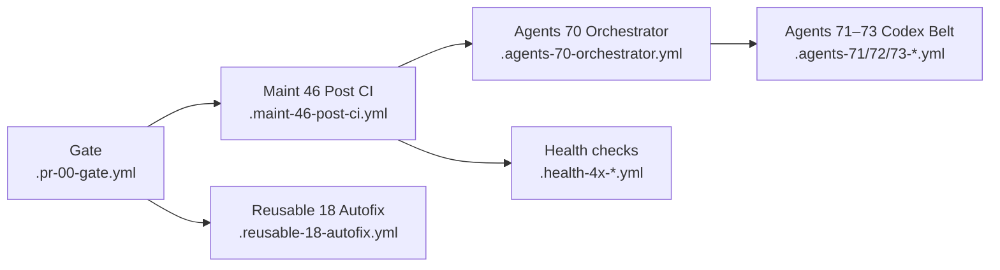
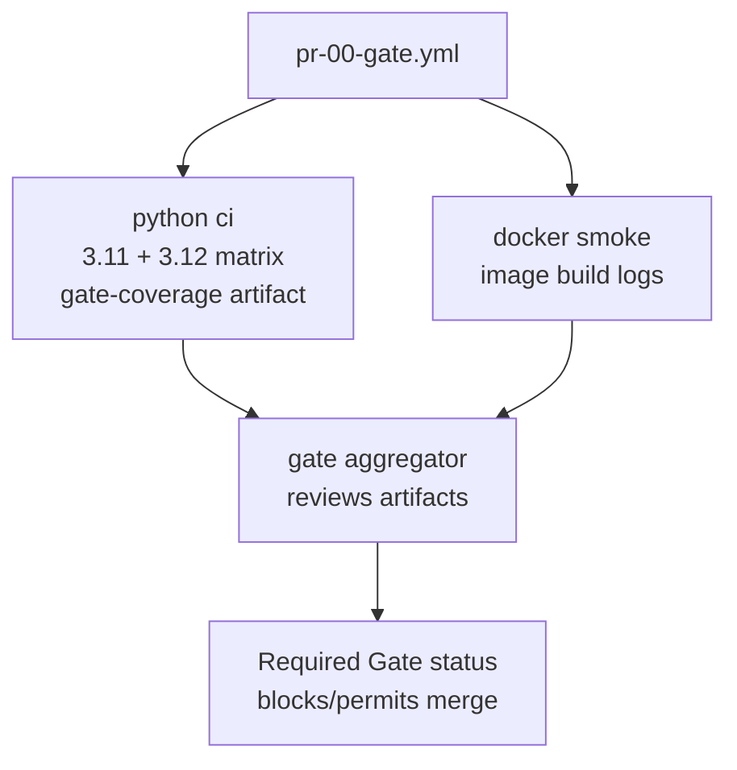

# CI Workflow Layout

This page captures the target layout for the automation that protects pull requests, heals small issues, and keeps the repository health checks aligned. Each section links directly to the workflow definitions so future changes can trace how the pieces fit together.

> ℹ️ **Scope.** This catalog lists active workflows only. Historical entries and
> verification notes live in [ARCHIVE_WORKFLOWS.md](../archive/ARCHIVE_WORKFLOWS.md).

## Target layout



- **PR checks:** [Gate](../../.github/workflows/pr-00-gate.yml) fans out to the reusable Python CI matrix and Docker smoke tests before posting the commit status summary.
- **Autofix path:** [Maint 46 Post CI](../../.github/workflows/maint-46-post-ci.yml) consumes Gate artifacts and, when labels permit, calls [Reusable 18 Autofix](../../.github/workflows/reusable-18-autofix.yml) for hygiene pushes or patch uploads.
- **Agents control plane:** Successful Gate runs dispatch the [Agents 70 Orchestrator](../../.github/workflows/agents-70-orchestrator.yml), which coordinates the [Codex belt](../../.github/workflows/agents-71-codex-belt-dispatcher.yml) hand-off (dispatcher → worker → conveyor).
- **Health checks:** The [Health 4x suite](../../.github/workflows/health-40-repo-selfcheck.yml), [Health 41](../../.github/workflows/health-41-repo-health.yml), [Health 42](../../.github/workflows/health-42-actionlint.yml), [Health 43](../../.github/workflows/health-43-ci-signature-guard.yml), and [Health 44](../../.github/workflows/health-44-gate-branch-protection.yml) workflows provide scheduled drift detection and enforcement snapshots.

Start with the [Workflow System Overview](WORKFLOW_SYSTEM.md) for the
bucket-level summary, the [keep vs retire roster](WORKFLOW_SYSTEM.md#final-topology-keep-vs-retire), and policy checklist. Return
here for the detailed trigger, permission, and operational notes per workflow.

## CI & agents quick catalog

The tables below capture the **active** workflows, their triggers, required
scopes, and whether they block merges. Retired entries move to the
[archived roster](#archived-workflows) once deleted so contributors can locate
history without confusing it with the live inventory.

### Required merge gate

| Workflow | File | Trigger(s) | Permissions | Required? | Purpose |
| --- | --- | --- | --- | --- | --- |
| **Gate** | `.github/workflows/pr-00-gate.yml` | `pull_request`, `workflow_dispatch` | Explicit `contents: read`, `pull-requests: write`, `statuses: write` (doc-only comment + commit status). | **Yes** – aggregate `gate` status must pass. | Fan-out orchestrator chaining the reusable Python CI and Docker smoke jobs. Docs-only or empty diffs skip the heavy legs while Gate posts the friendly notice and reports success. |

#### Gate job map

Use this map when triaging Gate failures. It illustrates the jobs that run on
every pull request, which artifacts each produces, and how the final `gate`
enforcement step evaluates their results.

| Job ID | Display name | Purpose | Artifacts / outputs | Notes |
| --- | --- | --- | --- | --- |
| `python-ci` | python ci | Invokes `reusable-10-ci-python.yml` once with a 3.11 + 3.12 matrix. Runs Ruff, Mypy (on the pinned runtime), pytest with coverage, and emits structured summaries. | `gate-coverage`, `gate-coverage-summary`, `gate-coverage-trend` (primary runtime). | Single source of lint/type/test/coverage truth. Coverage payloads share the `gate-coverage` artifact under `artifacts/coverage/runtimes/<python>` for downstream consumers. |
| `docker-smoke` | docker smoke | Builds the project image and executes the smoke command through `reusable-12-ci-docker.yml`. | None (logs only). | Ensures packaging basics work before merge. |
| `gate` | gate | Downloads the reusable CI coverage bundle, renders lint/type/test/coverage results, and posts the commit status. | Job summary with pass/fail table. | Hard-fails if any upstream job did not succeed; this status is the required merge check. |


pull_request ──▶ Gate ──▶ Maint Post-CI summary
                    │              │
                    │              └─▶ Autofix / failure tracking (conditional)
                    └─▶ Reusable test suites (Python matrix & Docker smoke)
```

## Pull Request Gate

* [`Gate`](../../.github/workflows/pr-00-gate.yml) orchestrates the fast-path vs full CI decision, evaluates coverage artifacts, and reports commit status back to the PR.
* [`Reusable CI (Python)`](../../.github/workflows/reusable-10-ci-python.yml) drives the primary test matrix (lint, type-check, tests, coverage) for PR builds.
* [`Reusable CI (Docker)`](../../.github/workflows/reusable-12-ci-docker.yml) executes the container smoke test whenever Docker-related files change.

The gate uses the shared `.github/scripts/detect-changes.js` helper to decide when documentation-only changes can skip heavy jobs and when Docker smoke tests must run.

## Maint Post-CI Summary & Failure Handling

* [`maint-46-post-ci.yml`](../../.github/workflows/maint-46-post-ci.yml) consumes the completed Gate run, normalises coverage artifacts with `.github/scripts/coverage-normalize.js`, publishes the consolidated PR summary, and manages failure tracker issues.
* [`maint-coverage-guard.yml`](../../.github/workflows/maint-coverage-guard.yml) periodically verifies that the latest Gate run meets baseline coverage expectations.

The summary workflow updates its PR comment via `.github/scripts/comment-dedupe.js`, ensuring a single authoritative status thread per pull request.

## Autofix & Maintenance

* [`reusable-18-autofix.yml`](../../.github/workflows/reusable-18-autofix.yml) provides the shared jobs used by autofix callers to stage, classify, and report automatic fixes.
* [`maint-45-cosmetic-repair.yml`](../../.github/workflows/maint-45-cosmetic-repair.yml) invokes the reusable autofix pipeline on a schedule to keep cosmetic issues in check.
* [`maint-47-disable-legacy-workflows.yml`](../../.github/workflows/maint-47-disable-legacy-workflows.yml) sweeps the repository to make sure archived GitHub workflows remain disabled in the Actions UI.
* [`maint-keepalive.yml`](../../.github/workflows/maint-keepalive.yml) ensures Codex/autofix configuration stays fresh and pings for outstanding tasks.

## Agents Control Plane

The agent workflows coordinate Codex and chat orchestration across topics:

* [`agents-70-orchestrator.yml`](../../.github/workflows/agents-70-orchestrator.yml) and [`agents-73-codex-belt-conveyor.yml`](../../.github/workflows/agents-73-codex-belt-conveyor.yml) manage task distribution.
* [`agents-71-codex-belt-dispatcher.yml`](../../.github/workflows/agents-71-codex-belt-dispatcher.yml) and [`agents-72-codex-belt-worker.yml`](../../.github/workflows/agents-72-codex-belt-worker.yml) handle dispatching and execution.
* [`agents-63-codex-issue-bridge.yml`](../../.github/workflows/agents-63-codex-issue-bridge.yml) hydrates Codex bootstrap pull requests from labelled issues and can seed the primer comment.
* [`agents-63-chatgpt-issue-sync.yml`](../../.github/workflows/agents-63-chatgpt-issue-sync.yml) turns curated topic lists into triaged GitHub issues via the shared parsing helpers.
* [`agents-64-verify-agent-assignment.yml`](../../.github/workflows/agents-64-verify-agent-assignment.yml) validates that labelled issues retain an approved agent assignee and publishes the verification outputs.
* [`agents-guard.yml`](../../.github/workflows/agents-guard.yml) applies repository-level guardrails before agent workflows run.
* [`reusable-16-agents.yml`](../../.github/workflows/reusable-16-agents.yml) is the composite invoked by the orchestrator to run readiness, bootstrap, diagnostics, keepalive, and watchdog passes.

## Repository Health Checks

Scheduled health jobs keep the automation ecosystem aligned:

* [`health-40-repo-selfcheck.yml`](../../.github/workflows/health-40-repo-selfcheck.yml) synthesises a repo-wide self-check report.
* [`health-41-repo-health.yml`](../../.github/workflows/health-41-repo-health.yml) compiles dependency and hygiene signals.
* [`health-42-actionlint.yml`](../../.github/workflows/health-42-actionlint.yml) enforces workflow syntax quality.
* [`health-43-ci-signature-guard.yml`](../../.github/workflows/health-43-ci-signature-guard.yml) verifies signed workflow runs when required.
* [`health-44-gate-branch-protection.yml`](../../.github/workflows/health-44-gate-branch-protection.yml) ensures branch protection stays aligned with Gate expectations.

Together these workflows define the CI surface area referenced by the Gate and Maint Post-CI jobs, keeping the automation stack observable, testable, and easier to evolve.

## Self-test Harness

* [`selftest-reusable-ci.yml`](../../.github/workflows/selftest-reusable-ci.yml) exercises `reusable-10-ci-python.yml` across curated scenarios, publishing summaries or PR comments so maintainers can validate reusable changes before they ship.
